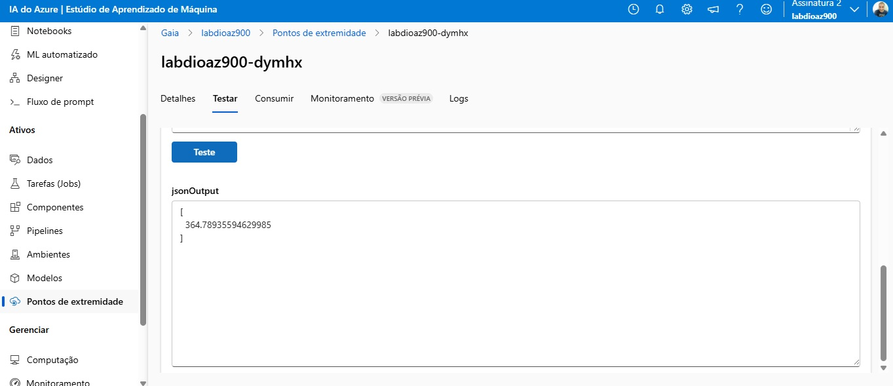

# 🚲 Previsão de Aluguel de Bicicletas - Azure Machine Learning

Este projeto foi desenvolvido como desafio prático da DIO, com o objetivo de construir e publicar um modelo de Machine Learning na Azure ML para prever a demanda de aluguel de bicicletas com base em variáveis climáticas e temporais.

---

## 📌 Objetivo

Criar um modelo de machine learning na plataforma Azure para prever o número de bicicletas alugadas, com base em variáveis como:
- Temperatura
- Umidade
- Estação do ano
- Dia da semana
- Feriado
- Condição climática, entre outras.

---

## 🧠 Tecnologias utilizadas

- Azure Machine Learning (Designer)
- Python (para preparação de dados)
- Endpoint REST para publicação do modelo
- Git & GitHub

---

## 📊 Dados utilizados

Foram utilizados dados históricos de aluguel de bicicletas. As principais variáveis utilizadas na modelagem foram:

```json
[
  "day", "mnth", "year", "season", "holiday", "weekday", "workingday",
  "weathersit", "temp", "atemp", "hum", "windspeed"
]
```

---

## 🚀 Pipeline no Azure Designer

O modelo foi criado no Azure ML Designer usando componentes visuais como:

- Dataset
- Select Columns
- Train Model
- Score Model
- Evaluate Model
- Deploy as Web Service

---

## 📡 Endpoint de Previsão

O modelo foi publicado com sucesso como um **endpoint REST** no Azure. Ele pode ser acessado com a seguinte configuração:

### 🧾 Arquivo de consumo: [`endpoints.json`](./endpoints.json)

Exemplo de entrada:
```json
{
  "input_data": {
    "columns": [
      "day", "mnth", "year", "season", "holiday", "weekday", "workingday",
      "weathersit", "temp", "atemp", "hum", "windspeed"
    ],
    "data": [[15, 6, 2022, 2, 0, 3, 1, 1, 0.35, 0.37, 0.59, 0.12]]
  }
}
```

Resposta do modelo:
```json
{
  "jsonOutput": [364.78935594629985]
}
```

---

## 🖼️ Resultado no Azure



---

## 📁 Estrutura do repositório

```
📦modelo-bike-azure
 ┣ 📜 README.md
 ┣ 📜 endpoints.json
 ┣ 📂 img
 ┃ ┗ resultado-endpoint.png
```

---

## ✅ Como testar

1. Baixe o arquivo [`endpoints.json`](./endpoints.json)
2. Substitua a chave de autenticação no campo `Authorization`
3. Use ferramentas como Postman, Insomnia ou Python `requests` para testar o modelo

---

## 🤝 Contribuição

Projeto desenvolvido para fins de aprendizado, como parte do desafio da [DIO.me](https://www.dio.me/).

**Autor:** [Marcos Gaia](https://github.com/marcosgaia) 👨‍💻
**base:**  https://microsoftlearning.github.io/mslearn-ai-fundamentals/Instructions/Labs/01-machine-learning.html
